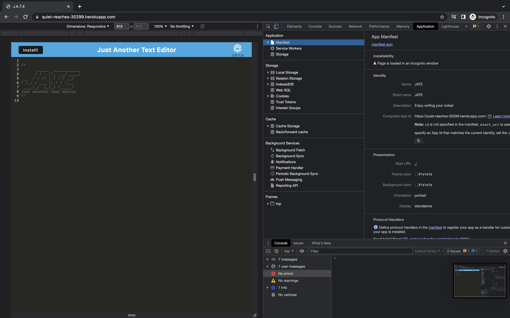
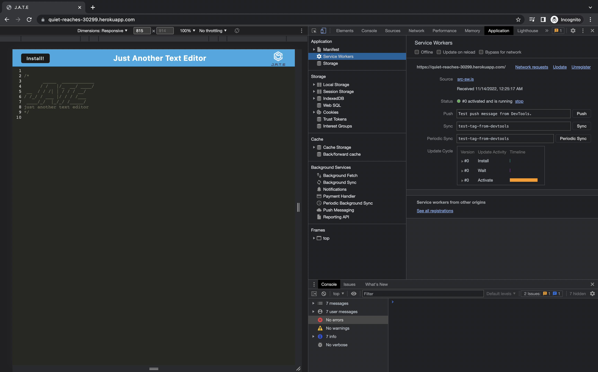
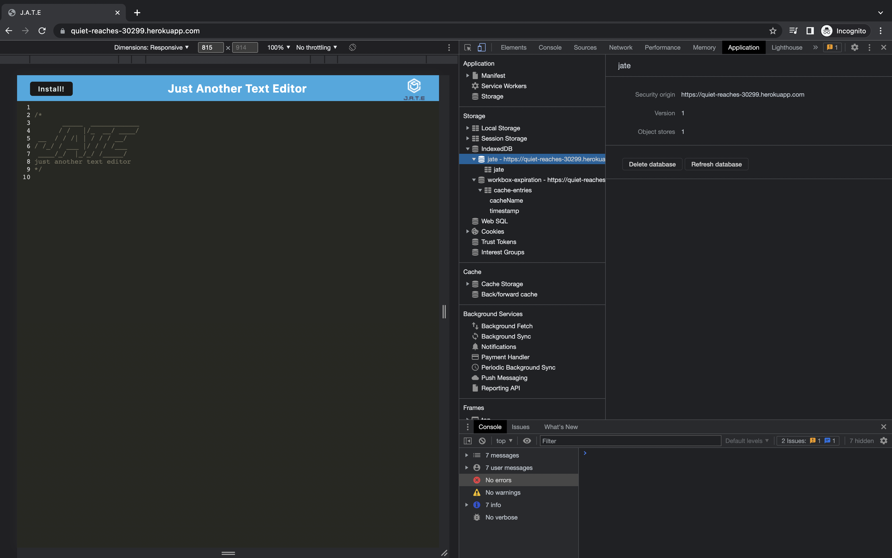

# PWA-text-editor

## DESCRIPTION 📎 :

Created a simple text editor app that can function both online and offline. Needed to use a variety of data persistence options in order to ensure that data is not lost in any scenario. The application first looks to use the data in the indexedDB to populate the editor, then if it cannot access that it will use local storage. For use offline, this application can be downloaded to your desktop as an application. This application is helpful to developers because they can use this as a scratch pad for code snippets and coding ideas. User story is below.

## FEATURE :

GIVEN a text editor web application,

- If open my application in my editor, I should see a client server folder structure.
- If I run `npm run start` from the root directory, I find that my application should start up the backend and serve the client.
- If I run the text editor application from my terminal, I find that my JavaScript files have been bundled using webpack.
- If I run my webpack plugins, I find that I have a generated HTML file, service worker, and a manifest file.
- If I use next-gen JavaScript in my application, I find that the text editor still functions in the browser without errors.
- If I open the text editor, I find that IndexedDB has immediately created a database storage.
- If I enter content and subsequently click off of the DOM window, I find that the content in the text editor has been saved with IndexedDB.
- If I reopen the text editor after closing it, I find that the content in the text editor has been retrieved from our IndexedDB.
- If I click on the Install button, I download my web application as an icon on my desktop.
- If I load my web application, I should have a registered service worker using workbox.
- If I register a service worker, I should have my static assets pre cached upon loading along with subsequent pages and static assets.
- If I deploy to Heroku, I should have proper build scripts for a webpack application

## SCREENSHOTS :

 The following image shows the application's `manifest.json` file:

 

 The following image shows the application's registered service worker:

The following image shows the application's IndexedDB storage:

## HEROKU LINNK TO INSTALL THE WEB APP :

https://quiet-reaches-30299.herokuapp.com/

## Technologies Used: 

javascript, node, express,  Webpack